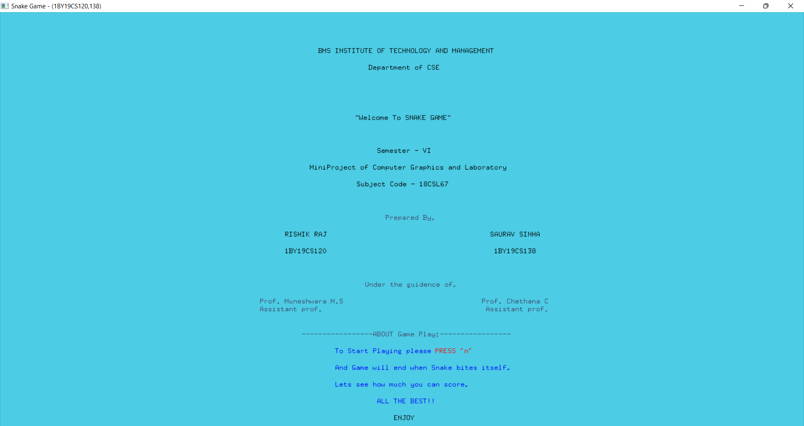
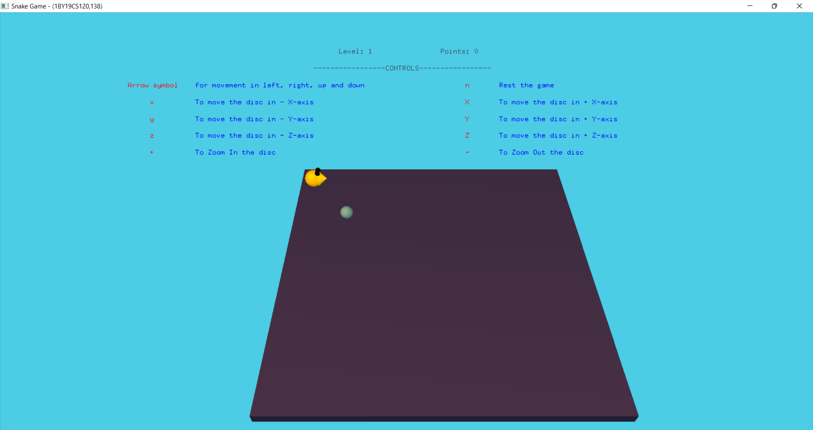
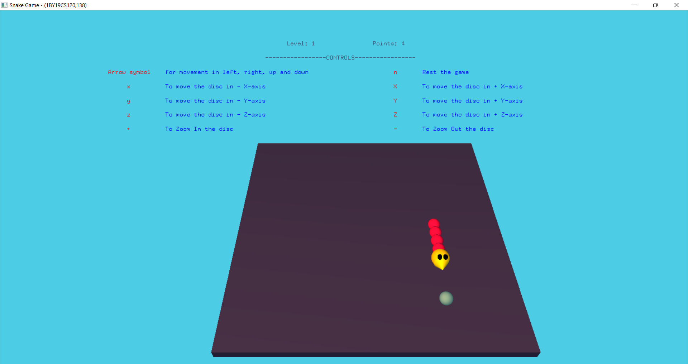
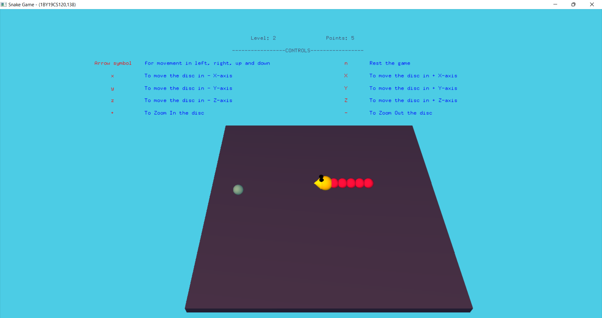

# THE-SNAKE-GAME

This is a project developed by Rishik Raj and Saurav Sinha for our computer graphics subject project in our 6th semester. The game is a Windows application of the classic 3-D Snake game and is completely built in C++ using the OpenGL/glut library, which provided the necessary graphics and game development tools.

## Table of Contents

- [THE SNAKE GAME](#The-Snake-Game)
  - [Table of Contents](#table-of-contents)
  - [Installation](#installation)
  - [Usage](#usage)
  - [Features](#features)
  - [Technologies Used](#technologies-used)
  - [Contributing](#contributing)
  - [License](#license)

## Installation

To install and run the game, follow these steps:

1. Clone the repository to your local machine using `git clone https://github.com/rishikraj990/The-Snake-Game.git`.
2. Navigate to the project directory.
3. To run the game, you need to have C++ and the GL/glut library installed on your computer.
4. Compile the code using a C++ compiler.
4. Run the executable file to start the game.

## Usage

The 3-D game involves controlling a snake on a disc-shaped playing field. The snake will try to eat randomly generated food, and as it eats, its length will increase. The direction of the snake's movement is controlled by arrow buttons.

In addition, players can move the disc in x, y, and z axes, and even zoom in and out of the disc.

## Features

The following features are available in the game:

- One players can play the game.
- Randomly generated food for the snake to eat
- Players can controll the snake movement by arrow buttons.
- Snake length increases as it eats food.
- 3D game with player able to move the disc in x, y, and z axis.
- Player can zoom in and out of the disc.
- The game ends when the snake bites itself.

## Technologies Used

The following technologies were used in the development of this project:

- C++
- OpenGL/glut library

## Contributing

Contributions to the project are welcome. To contribute, follow these steps:

1. Fork the repository.
2. Create a new branch for your changes.
3. Make your changes and commit them with a descriptive commit message.
4. Push your changes to your forked repository.
5. Submit a pull request to the original repository with a description of your changes.

## License

This project is licensed under the MIT License. See the `LICENSE` file for more information.
